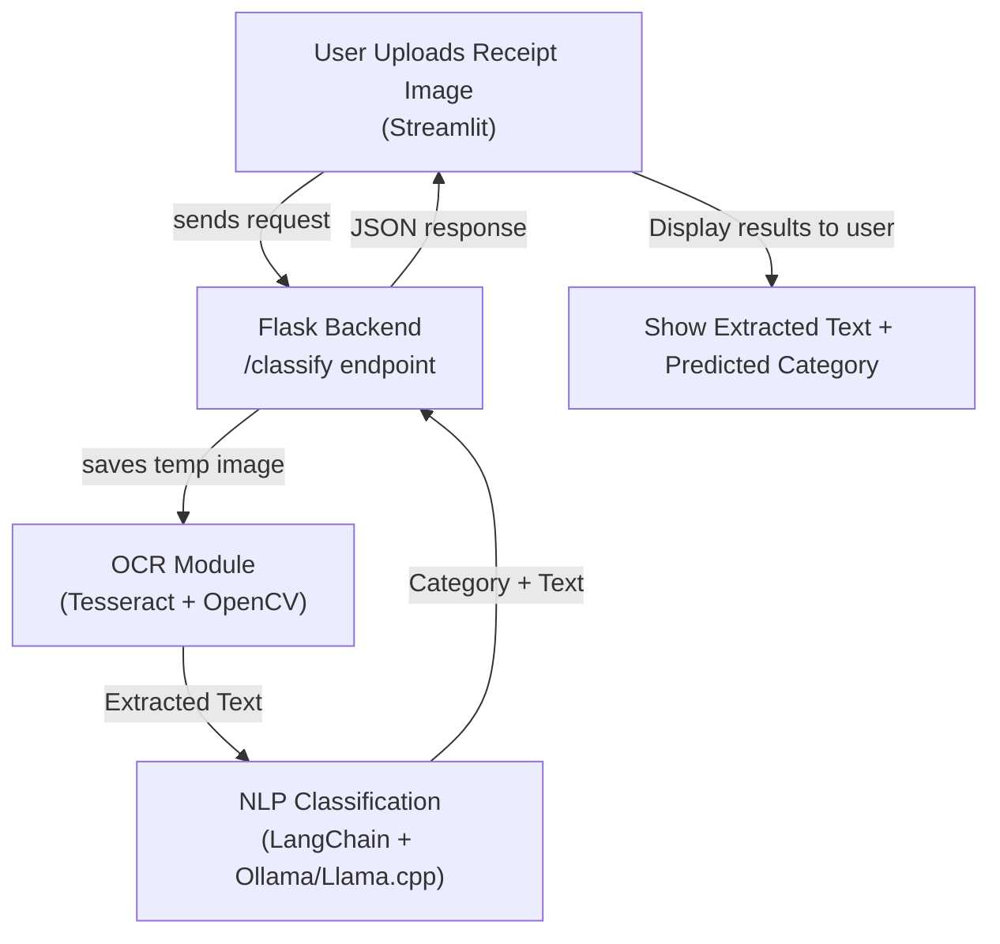

# DeductAI: AI-Powered Tax Deduction Classifier

DeductAI is a smart, privacy-focused application designed to simplify expense tracking for tax purposes. Upload an image of a receipt, and DeductAI uses local Optical Character Recognition (OCR) and AI-powered classification to extract text and categorize expenses into the correct IRS tax deduction categories. Features include PDF report generation and intelligent fallback classification when advanced AI models are unavailable.

 <!-- Add a screenshot of your UI to the images folder -->

---

## ✨ Key Features

- **Privacy-First:** All processing happens locally. Your receipt data never leaves your machine.
- **Accurate OCR:** Utilizes **EasyOCR** with advanced image preprocessing to accurately extract text from various receipt formats.
- **AI-Powered Classification:** Leverages local LLMs (Ollama or Llama.cpp) for intelligent and context-aware expense categorization.
- **Intelligent Fallback:** If the LLM is unavailable, it uses a robust keyword-based classifier to ensure continuous operation.
- **PDF Export:** Save classification results, including the receipt image and extracted text, as a professional PDF report.
- **User-Friendly Interface:** A simple, clean web interface built with Streamlit for easy receipt uploads and clear results.
- **Robust Backend:** Built with Flask, providing a stable and scalable API.
- **Extensible:** Easily customizable prompts and models to adapt to different classification needs.

---

## ⚙️ How It Works (The Flow)

### 🛠️ Project Workflow Diagram



The application follows this simple but powerful data flow:

1.  **User Upload (Frontend):** You upload a receipt image via the Streamlit web interface.
2.  **Backend Request (Flask):** The image is sent to the Flask server.
3.  **Image Processing & OCR (EasyOCR):** The server saves the image, preprocesses it to improve quality, and uses EasyOCR to extract all readable text.
4.  **AI Classification:** The extracted text is passed to a local LLM (e.g., Llama 3 via Ollama) with a specialized prompt. If the LLM is unavailable, it falls back to intelligent keyword-based classification.
5.  **JSON Response:** The backend returns the extracted text and the predicted tax category to the frontend.
6.  **Display Results:** The Streamlit UI displays the results, showing you the extracted text, final category, and a PDF download button.

---

## 📚 Tech Stack

- **Frontend:** [Streamlit](https://streamlit.io/)
- **Backend:** [Flask](https://flask.palletsprojects.com/)
- **OCR:** [EasyOCR](https://github.com/JaidedAI/EasyOCR) with fallback to preprocessing
- **Image Processing:** [OpenCV](https://opencv.org/), [Pillow](https://python-pillow.org/)
- **AI/NLP:** [LangChain](https://www.langchain.com/) orchestrating a local LLM
- **LLM Engine (Primary):** [Ollama](https://ollama.ai/) running models like Llama 3
- **LLM Engine (Alternative):** [Llama.cpp](https://github.com/ggerganov/llama.cpp)
- **Fallback Classification:** Keyword-based intelligent classifier
- **PDF Generation:** [ReportLab](https://pypi.org/project/reportlab/) for professional PDF reports
- **Dependencies:** PyTorch, NumPy, SciPy for machine learning operations

---

## 🚀 Getting Started

Follow these steps to get DeductAI running on your local machine.

### 1. Prerequisites

- **Python 3.9+**
- **Ollama (Optional):** For advanced AI classification. If not installed, the app will use fallback classification.
    - [Download Ollama here](https://ollama.ai/)
    - Note: EasyOCR is included in requirements.txt and doesn't require separate installation

### 2. Installation

1.  **Clone the repository:**
    ```bash
    git clone <your-repo-url>
    cd deductai-ocr-nlp
    ```

2.  **Create a virtual environment (recommended):**
    ```bash
    python -m venv .venv
    source .venv/bin/activate  # On Windows, use `.venv\Scripts\activate`
    ```

3.  **Install the required Python packages:**
    ```bash
    pip install -r requirements.txt
    ```

4.  **Pull the LLM model with Ollama:**
    ```bash
    ollama pull llama3
    ```

### 3. Running the Application

You need to run two separate processes in two different terminals.

1.  **Terminal 1: Start the Flask Backend:**
    ```bash
    python src/app.py
    ```
    The backend server will start on `http://localhost:5000`.

2.  **Terminal 2: Start the Streamlit Frontend:**
    ```bash
    streamlit run src/ui.py
    ```
    The frontend application will open in your web browser, usually at `http://localhost:8501`.

### 4. Usage

- Ensure both the backend and frontend servers are running.
- Open the Streamlit URL in your browser.
- Upload a receipt image (supported formats: JPG, PNG, GIF, BMP).
- Click the "🤖 Classify Expense" button.
- View the classification results including:
  - Predicted tax deduction category
  - Extracted text from the receipt
  - Classification confidence level
- Click "📄 Save as PDF" to download a professional report containing the receipt image and results.

## 🎯 Supported Tax Categories

DeductAI classifies expenses into these IRS-approved categories:

- **Business Meals** - Restaurant expenses, client dinners
- **Travel** - Flights, hotels, rental cars, rideshares
- **Office Supplies** - Stationery, software, equipment
- **Utilities** - Internet, phone, electricity bills
- **Home Office** - Rent/mortgage portion for home office
- **Advertising** - Marketing services, promotional materials
- **Professional Development** - Courses, conferences, books
- **Insurance** - Business liability, professional indemnity
- **Legal & Professional Services** - Lawyer, accountant fees
- **Vehicle Expenses** - Gas, maintenance, repairs
- **Other** - Valid business expenses not fitting above categories

## 🛡️ Fallback System

If Ollama or the LLM is unavailable, DeductAI automatically switches to a robust keyword-based classifier that can handle common expense types, ensuring the application continues to work even without advanced AI models.

---

## 🔧 Configuration

### Using Llama.cpp instead of Ollama

If you prefer to use a local GGUF model file with Llama.cpp:

1.  Download a GGUF-format model (e.g., from [Hugging Face](https://huggingface.co/models?sort=trending&search=gguf)).
2.  Create a `models` folder in the root of the project and place your `.gguf` file inside.
3.  Edit `src/classify.py` and make the following changes:
    - Set `USE_LLAMA_CPP = True`.
    - Update the `MODEL_PATH` to point to your model file.

---

## 📂 Project Structure

```
. deductai-ocr-nlp
├── src
│   ├── app.py            # Flask backend server with PDF generation
│   ├── ui.py             # Streamlit frontend UI with PDF export
│   ├── ocr.py            # OCR logic with EasyOCR
│   ├── classify.py       # AI classification with fallback system
│   └── __init__.py
├── images
│   └── screenshot.png    # Example screenshot for README
├── docker-compose.yml    # Docker configuration
├── docker-compose.prod.yml
├── .gitignore
├── requirements.txt      # Python dependencies
└── README.md             # This file
```

## 📄 License

This project is licensed under the MIT License. See the `LICENSE` file for details.
